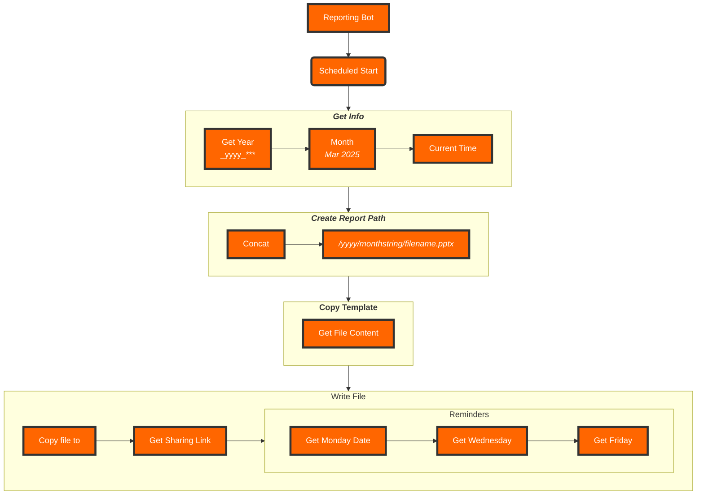

# Reporting Bot Flow Diagram

```mermaid
flowchart TD
classDef default fill:#ff6600,stroke:#333,stroke-width:4px, color: #ffffff;
    A[Reporting Bot] --> B(Scheduled Start)
    B-->getinfo-->createpath[Create Path]-->copyTemplate-->writeNewfileSub

subgraph getinfo["`***Get Info***`"]
    direction LR
    dateinfo["Get Year <br> _yyyy_***"]-->
    monthInfo["`Month <Br> _Mar 2025_`"]-->
    getCurrntTimeStamp["Current Time"]
end

subgraph createpath["`***Create Report Path***`"]
    concatVariables[Concat]-->
    pathstring["`_/yyyy/monthstring/filename.pptx_`"]
end


subgraph copyTemplate["`**Copy Template**`"]
    getFile[Get File Content]

end


subgraph writeNewfileSub[Write File]
    wrriteNewFile[Copy file to]-->getfilelink[Get Sharing Link]-->remindersTime[Reminders]
end

subgraph remindersTime[Reminders]
  direction LR
  getNextMonday[Get Monday Date]-->getWednesayDate[Get Wednesday]-->getNextFridayDate[Get Friday]

end


```
